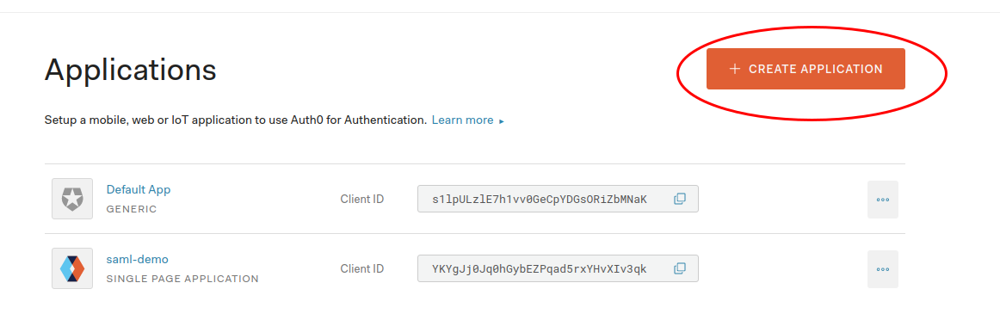

# SAML Feature

登录方式增加SAML协议，为了完整的流程体验，该版本采用Auth0作为SAML IDP（Identity Provider ），后面根据具体的IDP选择再定制化开发。

## 1. AIArtsBackend 配置

### 密钥配置
openssl创建密钥对

>`openssl req -x509 -newkey rsa:2048 -keyout saml-sp.key -out saml-sp.cert -days 365 -nodes -subj "/CN=auth.apulis.com"`

然后load到kubenetes的scretes里面管理
>`kubectrl create secrete tls saml-sp-secret --key=saml-sp.key --cert=saml-sp.cert`

运行kubectl get secrets，确保screte已经被正确load到集群， 出现下面的记录：

### 服务YAML配置

**修改ClusterBootstrap/services/aiarts-backend/aiarts-backend.yaml**
增加secret volume设置：
>volumes:
   ......
   - name: saml-secret
     secret:
       secretName: saml-sp-secret

增加volumeMounts设置:
>volumeMounts:
   ......

   - mountPath: /root/saml-certs
      name: saml-secret

**修改ClusterBootstrap/services/aiarts-backend/aiarts-backend.yaml**
auth section需要增加saml的相关配置，通知auth服务url需要配置

> auth:
  	url: http://{{cnf["kube-vip"]}}:80
   	key: "Sign key for JWT"
   	samlRootUrl: {{ cnf["saml_root_url"] }}
   	samlIdpMetadataURL: {{cnf["saml_idp_metadata_url"]}}
   	samlPrivateKey: /root/saml-certs/tls.key
   	samlCertificate: /root/saml-certs/tls.crt

其中samlIdpMetadataURL的值需要在Auth0的配置获取，详细见
根section 需要增加samlRootUrl配置，用于IDP获取metadata和acs服务接口。
**注意:** *rootUrl需要根据实际环境配置，需要是EndUser(例如浏览器等)能直接访问的地址*
sp这边会跟据rootUrl生成几个地址，保证这几个地址能访问到：

>${samlRootUrl}/saml/metadata
>
>${samlRootUrl}/saml/acs

## 2. AIArts Frontend设置（by xianjie）

## 3. Auth0 IDP 参数设置
1. 访问https://auth0.com/ 并注册用户登录
2. 创建自定义tanent
  
3. 创建application
 

4. Application 设置
	开启Saml Support

	配置Saml ACL地址

	查看idp metadata endpoint 并记录，很重要
    
    图中的Identity Provider Login URL 值作为auth.samlIdpMetadataURL的值